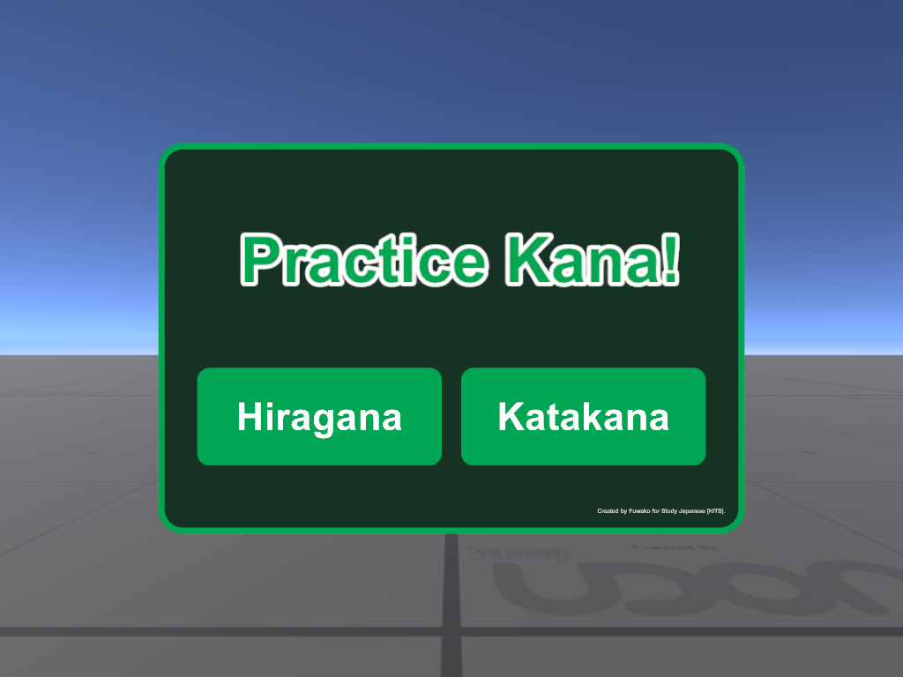
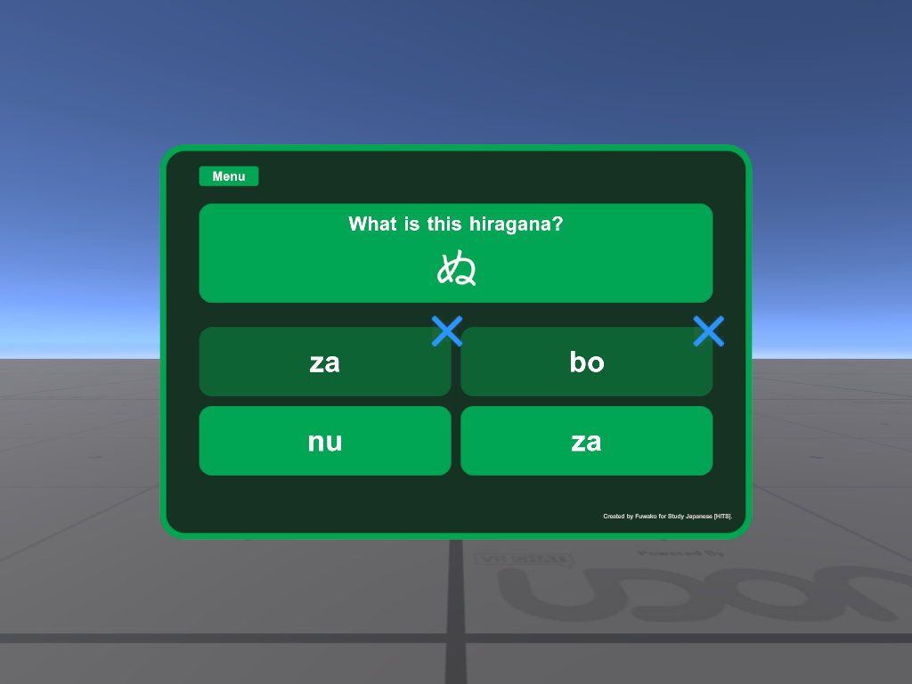
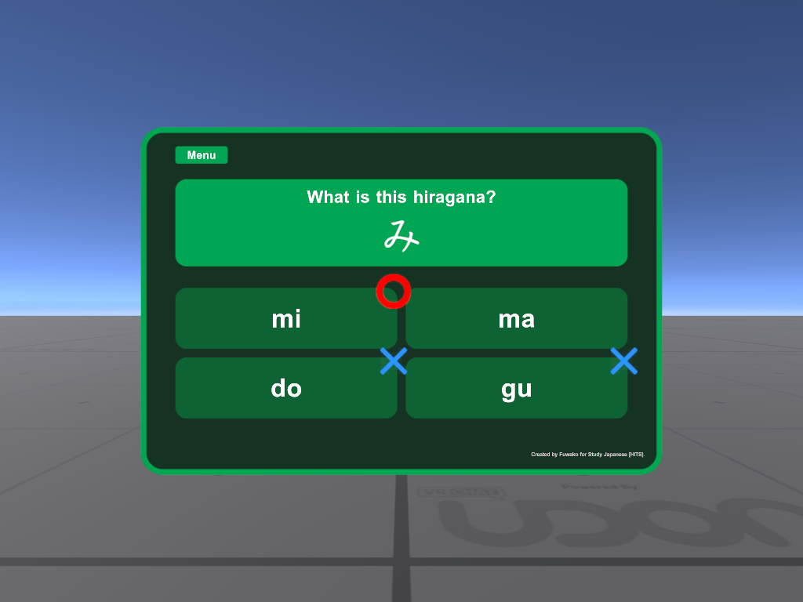
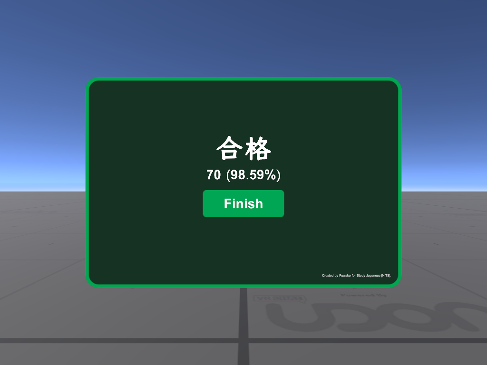

# Kana Practice

Kana Practice is a Unity prefab for the VRChat group Study Japanese【 HiTs 】.

It is an interactive user-interface for practicing the Japanese syllabary.

- Built in Unity 2019.4.31f1.
- Programmed in VRChat Udon with UdonSharp.

## Features
- Hiragana practice.
- Katakana practice.
- Dakuon and handakuon.
- Answers based on Hepburn romanization.
- Randomized multiple choice questions.
- Audiovisual feedback.
- Repeatable self-testing.
- Scoring system.

## Preview

</img> </img> 
</img> </img>

## Setup

Please read all instructions before proceeding.

1. Download the **KanaPractice** unitypackage from [Releases](https://github.com/fuwako/vrchat-prefabs/releases/tag/Prefab).
2. Import the **KanaPractice** unitypackage into your Unity project.
3. In Unity, inside the imported KanaPractice asset directory, drag the **Kana Practice** prefab into the Hierarchy or Scene window.
    * The Prefab depends on TextMesh Pro. If you have never used TextMesh Pro within your Unity project, Unity will automatically prompt you to import the dependency via TMP Importer. Click *Import TMP Essentials*.

## Optional

### Configuration 

On the **Kana Practice** game object, the **Kana Practice** script component can be found. 

This script contains various properties that are critical to the function of the prefab. 
You can mouseover the label of each property to view tooltip descriptions of each property.

### TextMesh Pro Font Assets

If you need to create your own TextMesh Pro font asset, the respective English and Japanese character sets, that are necessary for displaying text, are included in the unitypackage. 

In the Font Asset Creator:
- set **Character Set** to `Characters from File`.
- set **Character File** to `charset_english` or `charset_japanese`.

This will limit the generated font asset to the specified symbols and exclude unnecessary symbols.

## Credits
[Klee](https://github.com/fontworks-fonts/Klee)